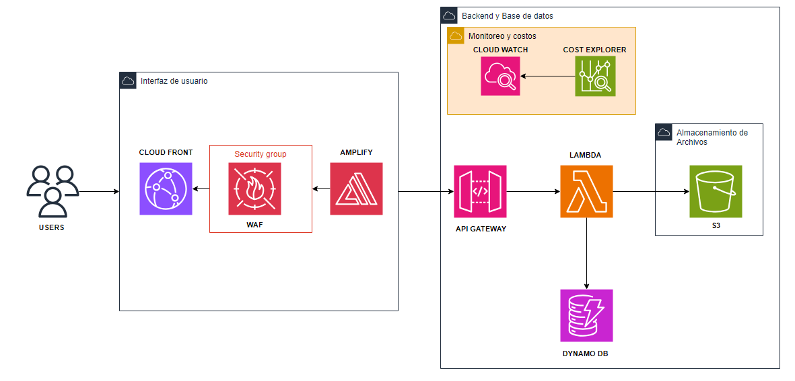

# **Gestión de Incidentes de Seguridad - Proyecto en AWS**

## **Descripción**
Este proyecto es una plataforma web diseñada para gestionar incidentes de seguridad de manera eficiente. Forma parte de mi aprendizaje práctico de AWS mientras me preparo para obtener la certificación AWS Certified Cloud Practitioner. El objetivo es implementar una solución real que utilice múltiples servicios de AWS, aprendiendo su configuración, integración y gestión dentro de la capa gratuita.

---

## **Objetivo**
Desarrollar una plataforma centralizada para registrar, almacenar y consultar incidentes de seguridad, integrando servicios de AWS para garantizar escalabilidad, seguridad y eficiencia.
- Registrar incidentes de seguridad con detalles como descripción, prioridad y estado.
- Subir y almacenar archivos PDF relacionados con los incidentes.
- Consultar, buscar y filtrar los incidentes registrados.
- Garantizar seguridad, optimización de costos y monitoreo continuo con AWS.

---

## **Servicios de AWS Utilizados**
1. **Frontend:** AWS Amplify.
2. **Backend:** API Gateway, AWS Lambda.
3. **Base de Datos:** DynamoDB.
4. **Almacenamiento:** Amazon S3.
5. **Seguridad:** IAM, WAF.
6. **Entrega de Contenido:** CloudFront.
7. **Monitoreo:** CloudWatch y Cost Explorer.

---
## **Arquitectura**



---

## **Guía Paso a Paso**

### **1. Configuración de AWS Amplify**
1. **Crear la aplicación frontend:**
   - Clonar el repositorio:
     ```bash
     git clone https://github.com/HugoBrandonHc/security-incidents.git
     cd security-incidents
     ```
   - Conecta el repositorio a AWS Amplify:
     1. Ve a AWS Amplify y selecciona "Conectar aplicación".
     2. Selecciona GitHub y elige tu repositorio.
   - Configura el comando de compilación:
     ```bash
     npm run build
     ```
   - Publica la aplicación y obtén el dominio.

2. **Probar el frontend:**
   - Asegúrate de que el formulario carga correctamente en el dominio generado.

---

### **2. Crear y Configurar API Gateway**
1. **Crear una API REST:**
   - Define las rutas:
     - `POST /incidentes`: Para registrar incidentes.
     - `GET /listar`: Para listar los incidentes.
   - Conecta cada ruta a su correspondiente Lambda.

2. **Configurar CORS:**
   - En ambas rutas, habilita CORS para permitir solicitudes desde tu dominio de Amplify y CloudFront.

3. **Probar con Postman:**
   - Configura los métodos POST y GET en Postman:
     - **POST:** Envía un JSON como este:
       ```json
       {
           "id_incidente": "incidente-001",
           "descripcion": "Falla crítica en el servidor",
           "estado": "Abierto",
           "prioridad": "Alta",
           "archivo": "BASE64_DE_TU_PDF"
       }
       ```
     - **GET:** Obtendrás un listado de incidentes registrados.

---

### **3. Configurar AWS Lambda**
1. **Registrar Incidente (POST):**
   - Código Lambda:
     ```javascript
     const { S3Client, PutObjectCommand } = require("@aws-sdk/client-s3");
     const { DynamoDBClient, PutItemCommand } = require("@aws-sdk/client-dynamodb");

     const s3 = new S3Client({ region: "us-east-2" });
     const dynamoDB = new DynamoDBClient({ region: "us-east-2" });

     exports.handler = async (event) => {
         const bucketName = "tu-bucket";
         const folder = "pdf/";
         const body = JSON.parse(event.body);

         const { id_incidente, descripcion, estado, prioridad, archivo } = body;
         const fileName = `${folder}${id_incidente}.pdf`;
         const fileContent = Buffer.from(archivo, "base64");

         try {
             await s3.send(new PutObjectCommand({
                 Bucket: bucketName,
                 Key: fileName,
                 Body: fileContent,
                 ContentType: "application/pdf",
             }));

             await dynamoDB.send(new PutItemCommand({
                 TableName: "IncidentesSeguridad",
                 Item: {
                     id_incidente: { S: id_incidente },
                     descripcion: { S: descripcion },
                     estado: { S: estado },
                     prioridad: { S: prioridad },
                     archivo_s3: { S: `s3://${bucketName}/${fileName}` },
                 },
             }));

             return { statusCode: 200, body: JSON.stringify({ message: "Incidente registrado correctamente" }) };
         } catch (error) {
             return { statusCode: 500, body: JSON.stringify({ message: "Error al registrar incidente", error }) };
         }
     };
     ```

2. **Listar Incidentes (GET):**
   - Código Lambda:
     ```javascript
     const { DynamoDBClient, ScanCommand } = require("@aws-sdk/client-dynamodb");
     const dynamoDB = new DynamoDBClient({ region: "us-east-2" });

     exports.handler = async () => {
         try {
             const data = await dynamoDB.send(new ScanCommand({ TableName: "IncidentesSeguridad" }));
             const items = data.Items.map(item => ({
                 id_incidente: item.id_incidente.S,
                 descripcion: item.descripcion.S,
                 estado: item.estado.S,
                 prioridad: item.prioridad.S,
                 archivo_s3: item.archivo_s3.S,
             }));

             return { statusCode: 200, body: JSON.stringify(items) };
         } catch (error) {
             return { statusCode: 500, body: JSON.stringify({ message: "Error al listar incidentes", error }) };
         }
     };
     ```

3. **Pruebas:**  
   - Ejecuta pruebas desde API Gateway y Postman.

---

### **4. Configurar S3**
1. Crea un bucket llamado `tu-bucket`.
2. Configura una política pública:
   ```json
   {
       "Version": "2012-10-17",
       "Statement": [
           {
               "Effect": "Allow",
               "Principal": "*",
               "Action": "s3:GetObject",
               "Resource": "arn:aws:s3:::tu-bucket/pdf/*"
           }
       ]
   }

### **5. Configurar CloudFront y WAF**
1. **CloudFront**
   - Conecta CloudFront al dominio de Amplify
   - Configura políticas de caché y HTTPS
2. **WAF**
   - Configura reglas básicas para bloquear solicitudes maliciosas

## **Lecciones aprendidas**
   - Configuración y uso de múltiples servicios de AWS.
   - Implementación de un backend sin servidor.
   - Gestión de costos y optimización de la capa gratuita.

## **Próximos pasos** 
   - Añadir gráficos con Amazon QuickSight.
   - Explorar autenticación con Cognito en futuros proyectos.

## **Contacto**
- **Linkedin:** [https://www.linkedin.com/in/hugobrandonhuaytacortez/]([https://www.linkedin.com/in/tu-perfil/](https://www.linkedin.com/in/hugobrandonhuaytacortez/))

- **Correo:** [hugobrandon17@gmail.com](mailto:hugobrandon17@gmail.com)

